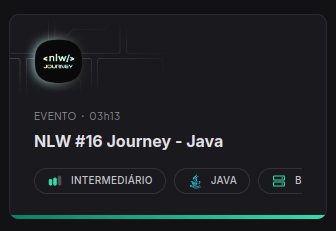

ProJeto Desenvolvido pela empresa [Rocketseat](https://www.rocketseat.com.br/) evento NLW-16 trilha Java.

Incluso alguns itens por [Lincoln de Souza](www.linkedin.com/in/lincolntec) a fim, de aumentar o aprendizado.

* CI.

* Swagger.

* TestesUnitarios e de integração.

* Observabilidade - Grafana

* Docker